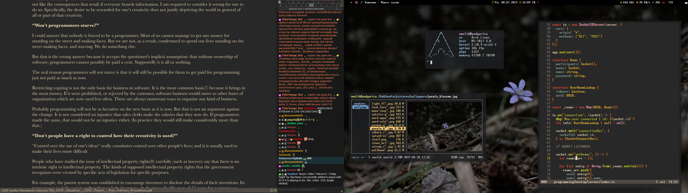

# dynamo58's dotfiles

<!-- 

	

 -->

## Programs
Some of the programs that I currently use...

Setup
- OS:         Arch Linux
- DE:         Xfce 4
- WM:         Xfwm4
- Audio:      PipeWire
- AUR helper: yay
- Shell:      zsh

Terminal & environment
- Terminal:             alacritty
- Terminal prompt:      <custom>
- Bar:                  polybar
- GTK Theme:            Adwaita-dark
- File explorer:        Thunar
- Application launcher: rofi
- Browser:              Firefox (developer edition)
- Text editor:          nvim
- Code editor:          VSCodium

Media
- Image viewing: sxiv
- Image editor:  gthumb
- Video viewing: mpv
- Video editor:  Kdenlive / FFmpeg / lossless-cut
- Music player:  mpv
- Recording:     OBS / kazam / gpu-screen-recorder
- Screenshots:   xfce4-screenshoter
- Document viewer: zathura (mupdf)

Other programs worth mentioning
- [piper](https://github.com/libratbag/piper)   - mouse configuration
- [filelight](https://github.com/KDE/filelight) - disk space visualization
- [obsidian](https://obsidian.md/)              - note taking
