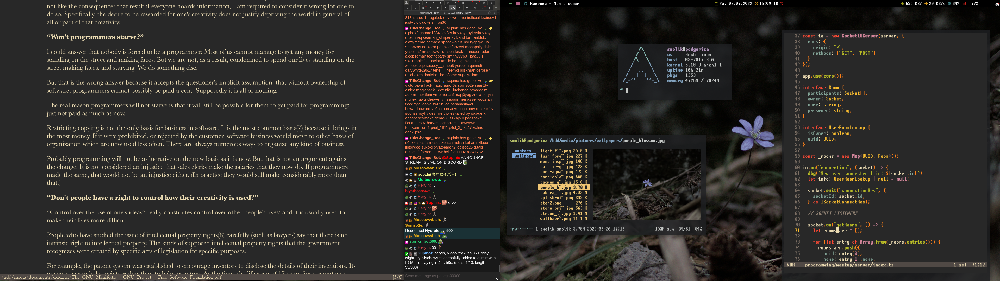

# dynamo58's dotfiles

	

	⚠ ⚠ ⚠  DISCLAIMER ⚠ ⚠ ⚠ ⚠ ⚠ 
	---  
	Some of the content here was not made by me. 
	When it is like a theme I try to credit with the link to the source. 
	Other times (fonts, papes e.g.) that is not the case.

## Programs

Some of the programs that I currently use

Setup
- OS:         Arch Linux
- DE:         Xfce 4
- WM:         Xfwm4
- Audio:      PipeWire
- AUR helper: yay
- Shell:      zsh

Terminal & environment
- Terminal:             alacritty
- Terminal prompt:      starship
- Bar:                  yabar
- GTK Theme:            Adwaita-dark
- File explorer:        Thunar / ranger
- Application launcher: xfce4-appfinder
- Browser:              Firefox (developer edition)
- Text editor:          nvim / VSCodium (de-microsofted build of VSCode)
- Code editor:          VSCodium

Media
- Image viewing: sxiv
- Image editor:  GIMP
- Video viewing: mpv
- Video editor:  Kdenlive / FFmpeg
- Music player:  mpv
- Recording:     OBS / kazam
- Screenshots:   xfce4-screenshoter
- Document viewer: zathura (+mupdf)

Other programs worth mentioning
- [piper](https://github.com/libratbag/piper)         - mouse configuration
- [filelight](https://github.com/KDE/filelight)       - disk space visualization
